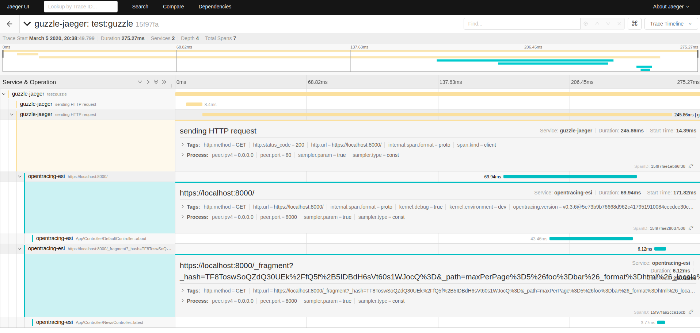

# ESI support

## Issue

Upon debugging the [Symfony implementation](https://github.com/symfony/symfony/blob/v3.4.38/src/Symfony/Component/HttpKernel/HttpCache/Esi.php#L48-L61)
and catching up on the [ESI language specification](https://www.w3.org/TR/2001/NOTE-esi-lang-20010804),
there is unfortunately no standardized way to implement a solution in the OpentracingBundle,
as the language specification has no concept of passing headers from the template request to the fragments.

However, the template request can pass query parameters to fragments.
But this is a non-standard way of propagating headers and will not be standardized by the [upcoming W3C specification](https://w3c.github.io/trace-context/#abstract),
which is why we will not consider query propagation as a workaround for this issue.

## Possible solution

Fortunately there is a possible way to prevent the observed disconnect between template and fragment traces but it depends heavily on the ESI implementation you use.

It is described in the ESI language specification (under "6. Protocol Considerations"):

> When an ESI template is processed, a separate request will need to be made for each include encountered. Implementations may use the original request's headers (e.g., Cookie, User-Agent, etc.) when doing so. Additionally, response headers from fragments (e.g., Set-Cookie, Server, Cache-Control, Last-Modified) may be ignored, and should not influence the assembled page.

This means that if you have any kind of trace-generating layer before hitting an ESI enabled page, you may be fine,
because the span context may be propagated by headers to both the template and the fragments.

You will need to find out if your used technology is capable of passing the original headers to all fragments.

## Example

Below is an example of an instrumented command, which performed a Guzzle request to our initial test project with ESI, and generated this trace:

## Conclusion

In conclusion, if the trace is generated before (by an instrumented request, command or other applications like Traefik or Nginx) and passed to an ESI page,
chances are good that you will get connected traces.

If not, our bundle has no power to fix that.